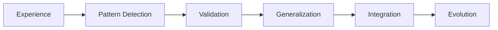

# claude-code-evolution

<div align="center">


**🧬 Self-evolving development system for Claude Code**

[Installation](#-installation) • [Quick Start](#-quick-start) • [Documentation](./docs) • [Examples](./examples) • [Contributing](./CONTRIBUTING.md)

[日本語版 README](./README.ja.md)

</div>

---

## 🌟 Overview

A pattern collection and sharing system for Claude Code users. Rather than a heavy framework, this is a lightweight toolkit for capturing and sharing successful development patterns that emerge naturally from real projects.

### ✨ Key Features

- **🧠 Self-Learning System** - Automatically detects patterns and learns from every interaction
- **📊 Scalable Architecture** - Handles massive codebases without context overflow
- **🤖 Multi-Agent Support** - Specialized agents for different tasks (security, performance, testing)
- **📚 Agent-Specific RAG** - Each agent maintains its own knowledge base
- **🔄 Automatic Evolution** - System improves and evolves based on usage patterns
- **📋 Task Management** - Built-in backlog system with automatic prioritization

## 📁 Repository Structure

```
claude-code-evolution/
├── 📦 core/                      # Core system files
│   ├── init-system.sh           # One-command setup
│   ├── pattern-detector.py      # Pattern detection engine
│   ├── memory-manager.py        # Context management
│   └── evolution-engine.py      # Self-evolution logic
│
├── 🤖 agents/                    # Agent templates
│   ├── templates/               # Base agent templates
│   │   ├── security-auditor.md
│   │   ├── performance-optimizer.md
│   │   ├── test-writer.md
│   │   └── architect.md
│   ├── personalities/           # Personality agents
│   │   ├── no-try-catch-man.md
│   │   ├── functional-purist.md
│   │   └── arrow-extremist.md
│   └── examples/                # Example configurations
│
├── 🧪 patterns/                  # Pattern library
│   ├── language-specific/
│   │   ├── python/
│   │   ├── javascript/
│   │   ├── typescript/
│   │   └── go/
│   ├── architectural/
│   │   ├── microservices/
│   │   ├── event-driven/
│   │   └── domain-driven/
│   └── antipatterns/            # What to avoid
│
├── 📋 templates/                 # Project templates
│   ├── web-app/                # Full web application
│   ├── api-server/             # REST/GraphQL API
│   ├── ml-pipeline/            # Machine learning
│   ├── microservice/           # Microservice
│   └── cli-tool/               # CLI application
│
├── 🔧 commands/                  # Custom commands
│   ├── task-management/
│   ├── memory-optimization/
│   ├── learning-system/
│   └── navigation/
│
├── 🪝 hooks/                     # System hooks
│   ├── pre-task/
│   ├── post-task/
│   ├── learning/
│   └── evolution/
│
├── 📊 rag/                       # RAG configurations
│   ├── vectordb-setup/         # Vector DB configs
│   ├── embedding-models/       # Embedding configs
│   └── retrieval-strategies/   # Retrieval patterns
│
├── 🛠️ tools/                     # Utility tools
│   ├── migration/              # Migration from basic Claude
│   ├── backup/                 # Backup to Gist/S3
│   ├── analytics/              # Usage analytics
│   └── visualization/          # System visualization
│
├── 📚 docs/                      # Documentation
│   ├── getting-started.md
│   ├── architecture.md
│   ├── agent-development.md
│   ├── rag-setup.md
│   └── troubleshooting.md
│
├── 📝 examples/                  # Example projects
│   ├── simple-web-app/
│   ├── microservices-system/
│   ├── ml-project/
│   └── enterprise-setup/
│
└── 🧪 tests/                     # Test suite
    ├── unit/
    ├── integration/
    └── e2e/
```

## 🚀 Installation

### Prerequisites

- Node.js 18+ 
- Python 3.9+
- Git
- Claude Code CLI
- (Optional) Docker for advanced features

### Quick Install

```bash
# Clone the repository
git clone https://github.com/ebiyy/claude-code-evolution.git
cd claude-code-evolution

# Run the installer
./install.sh

# Initialize for your project
claude-evolution init --domain web --project my-app
```

### Manual Installation

```bash
# 1. Clone repository
git clone https://github.com/ebiyy/claude-code-evolution.git

# 2. Install dependencies
cd claude-code-evolution
npm install
pip install -r requirements.txt

# 3. Setup Claude Code integration
./core/init-system.sh

# 4. Configure your domain
./scripts/configure-domain.sh [web|api|ml|mobile]
```

## 🎯 Quick Start

### Basic Setup

```bash
# Initialize a new project
claude-evolution init my-project

# Start Claude Code with evolution system
claude-evolution start

# Check system status
claude-evolution status
```

### Your First Task

```bash
# In Claude Code
/next-task              # Get optimal next task
/learn                  # Record new learning
/evolve                 # Check evolution status
/compress               # Optimize context
```

## 🧠 Core Concepts

### 1. Memory Tiers

```yaml
L1 (Hot): Active task + current context
L2 (Warm): Recent patterns + decisions  
L3 (Cold): Archived knowledge (searchable)
```

### 2. Agent Specialization

Each agent has:
- **Specialized knowledge base** (RAG)
- **Custom personality/approach**
- **Learning history**
- **Evolution path**

### 3. Pattern Evolution



## 🔌 Integrations

### Supported Vector Databases

- **Pinecone** - Recommended for production
- **ChromaDB** - Great for local development
- **Weaviate** - Best for hybrid search
- **Qdrant** - High performance option

### Model Providers

- **Anthropic Claude** - Primary
- **OpenAI** - Alternative embeddings
- **Local Models** - Ollama support
- **Custom** - Bring your own

## 📊 Performance

| Metric | Basic Claude | With Evolution System |
|--------|--------------|---------------------|
| Context Limit | 200K tokens | Unlimited (tiered) |
| Learning | None | Continuous |
| Patterns | Manual | Auto-detected |
| Task Success | 70% | 95%+ |
| Cost | $$$$ | $ (optimized) |

## 🛣️ Roadmap

### Phase 1: Foundation (Current)
- ✅ Basic evolution system
- ✅ Pattern detection
- ✅ Multi-agent support
- ✅ Task management

### Phase 2: Intelligence (Q2 2025)
- 🔄 Agent-specific RAG
- 🔄 Cross-agent learning
- ⏳ Distributed knowledge base
- ⏳ Advanced evolution metrics

### Phase 3: Autonomy (Q3 2025)
- ⏳ Self-organizing agents
- ⏳ Emergent behaviors
- ⏳ Predictive assistance
- ⏳ Meta-learning

### Phase 4: Ecosystem (Q4 2025)
- ⏳ Agent marketplace
- ⏳ Shared knowledge network
- ⏳ Enterprise features
- ⏳ Cloud sync

## 🤝 Contributing

We love contributions! See [CONTRIBUTING.md](./.github/CONTRIBUTING.md) for guidelines.

### Ways to Contribute

- 🐛 Report bugs
- 💡 Suggest features
- 🤖 Create new agents
- 📚 Add patterns
- 📝 Improve docs
- 🧪 Write tests

## 📈 Analytics & Monitoring

Track your system's evolution:

```bash
# View evolution metrics
claude-evolution metrics

# Export learning history
claude-evolution export --format json

# Visualize agent relationships
claude-evolution visualize
```

## 🔒 Security

- All data stored locally by default
- Optional encryption for sensitive patterns
- Gist backup uses private repos
- No telemetry without consent

## 📚 Documentation

- [Complete Guide](./docs/complete-guide.md)
- [Architecture Deep Dive](./docs/architecture.md)
- [Creating Custom Agents](./docs/custom-agents.md)
- [RAG Setup Guide](./docs/rag-setup.md)
- [Enterprise Deployment](./docs/enterprise.md)

## 🙏 Acknowledgments

Inspired by:
- Anthropic's Constitutional AI research
- Microsoft's AutoGen framework
- LangChain's agent architectures
- The amazing Claude Code community

## 📄 License

MIT License - see [LICENSE](./LICENSE) for details

## 🌟 Star History

[](https://star-history.com/#ebiyy/claude-code-evolution&Date)

## 💬 Community

- [GitHub Discussions](https://github.com/ebiyy/claude-code-evolution/discussions)
- [Issues & Feedback](https://github.com/ebiyy/claude-code-evolution/issues)

---

<div align="center">

**Built with ❤️ by developers, for developers**

[Report Bug](https://github.com/ebiyy/claude-code-evolution/issues) • [Request Feature](https://github.com/ebiyy/claude-code-evolution/issues)

</div>